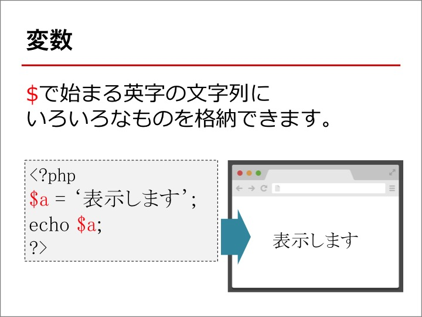
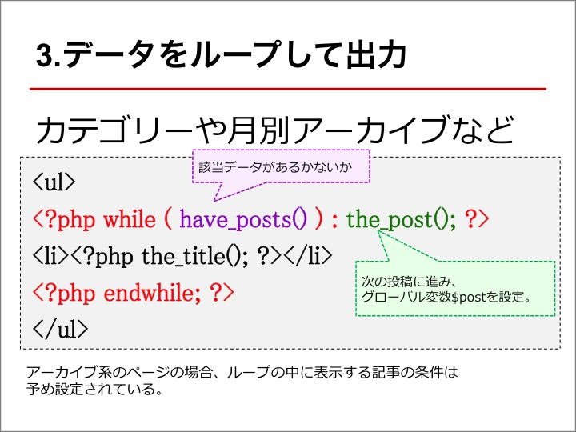

# ハンズオンの前に

## Lightningを利用の際の設定

テーマ Lightning をご利用のサイトでこの内容を行う場合は、結果が確認しやすいようにfunctions.phpに下記のコードを追記してください。
ヘッダーの固定が解除されます。

~~~
add_filter( 'lightning_headfix_enable', 'lightning_headfix_disabel');
function lightning_headfix_disabel(){
    return false;
}
~~~

## 本番環境しかない方の場合

~~~
<?php if(is_user_logged_in()){ ?>
ここにハンズオンのコードを貼ってください。
<?php } ?>
~~~

---

~~~

## 文字列 を表示する時は ' あるいは " でくくる

<?php echo '表示します。' ?>
~~~

---

~~~
<?php
$a = '表示します';
echo $a; 
?>
~~~

## 文字列の連結

phpで文字列を連結する時は . を使います。

~~~
<?php echo 'Hellow'.'World!!'; ?>
~~~

~~~
<?php 
$a = 'Hellow';
$b = 'World!!';
echo $a.$b;
?>
~~~

## ' と " の違い

~~~
<?php
$b = 'World';
echo "Hellow$b"." "; 
echo 'Hellow$b'.' '; 
?>
~~~

---

# 条件分岐

## 条件の比較

~~~
<?php
$a = 'white';
if ( $a == 'white' ) {
  echo 'ホワイト企業です。';
} else {
  echo 'ブラック企業です。';
}
?>
~~~

## WordPressで用意されている条件分岐タグ

~~~
<?php
echo '今表示しているページは ';
if ( is_front_page() ) {
  echo 'トップページ';
} else if ( is_page() ) {
  echo '固定ページ';
} else if ( is_single() ) {
  echo '投稿詳細ページ';
} else if ( is_category() ) {
  echo 'カテゴリーアーカイブページ';
} else if ( is_year() ) {
  echo '年別アーカイブページ';
} else if ( is_search() ) {
  echo '検索結果ページ';
} else if ( is_404() ) {
  echo 'Not Foundページ';
}
echo ' です。';
?>
~~~

[→ その他の条件分岐タグ](https://wpdocs.osdn.jp/%E6%9D%A1%E4%BB%B6%E5%88%86%E5%B2%90%E3%82%BF%E3%82%B0)

## a あるいは b

~~~
<?php
echo '今表示しているページは ';
if ( is_front_page() || is_page() ) {
  echo 'トップページか固定ページ';
} else {
  echo 'トップページか固定ページ以外のページ';
}
echo ' です。';
?>
~~~

## a なお且つ b

~~~
<?php
echo '今表示しているページは ';
if ( is_front_page() && is_page() ) {
  echo 'トップページでなお且つ固定ページ';
}
echo ' です。';
?>
~~~

## 否定

~~~
<?php
$a = 'りんご';
if ( $a != 'みかん' ) {
  echo $a.' は みかんではありません';
}
?>
~~~

---

比較が無い場合は、変数などに値が入っているかどうか

~~~
<?php
$a = 'white';
if ( $a ) {
  echo '値がはいっています。';
}
?>
~~~

~~~
<?php
$a = '';
if ( !$a ) {
  echo '値が入っていません';
}
?>
~~~

## 値が未定義だとエラーになる

~~~
<?php
// $aが定義されていないのでエラーになる
if ( $a ) {
  echo 'ホワイト企業です。';
}

// isser関数で$aが定義されているかをチェックしてから次に進む
if ( isset( $a ) && $a ) {
  echo 'ホワイト企業です。';
}
?>
~~~

カスタムフィールドでの利用例

※ 下記のコード実行の際は事前に 'age' というカスタムフィールドを作ってください。  
※ 表示したい記事のIDは任意で書き換えてください。

~~~
<table>
<tr><th>名前</th><td>山田太郎</td></tr>
<?php
$post_id = 4382;
$age = esc_html( get_post_meta( $post_id, 'age', true ) );
if ( $age ) {
  echo '<tr><th>年齢</th><td>'.$age.'</td></tr>';
} ?>
~~~

---

書き方のパターンはいくつかある

~~~
<?php
$a = 'white';
if ( $a ) {
  echo 'ホワイト企業です。';
} ?>
<?php if ( $a ) : ?>
<?php echo 'ホワイト企業です。'; ?>
<?php endif; ?>
~~~

---

# 関数を作ってみる

functions.phpにphpの処理を記述

~~~
function the_page_info(){
  echo '今表示しているページは ';
  if ( is_front_page() ) {
    echo 'トップページ';
  } else if ( is_page() ) {
    echo '固定ページ';
  } else if ( is_single() ) {
    echo '投稿詳細ページ';
  } else if ( is_category() ) {
    echo 'カテゴリーアーカイブページ';
  } else if ( is_year() ) {
    echo '年別アーカイブページ';
  } else if ( is_search() ) {
    echo '検索結果ページ';
  } else if ( is_404() ) {
    echo 'Not Foundページ';
  }
  echo ' です。';
}
~~~

WordPressのテンプレートファイルに下記を記述
~~~
<?php the_page_info();?>
~~~

---

## 変数に入れて値を返す

~~~
function get_page_info(){
  $page_info = '今表示しているページは ';
  if ( is_front_page() ) {
    $page_info .= 'トップページ';
  } else if ( is_page() ) {
    $page_info .= '固定ページ';
  } else if ( is_single() ) {
    $page_info .= '投稿詳細ページ';
  } else if ( is_category() ) {
    $page_info .= 'カテゴリーアーカイブページ';
  } else if ( is_year() ) {
    $page_info .= '年別アーカイブページ';
  } else if ( is_search() ) {
    $page_info .= '検索結果ページ';
  } else if ( is_404() ) {
    $page_info .= 'Not Foundページ';
  }
  $page_info .= ' です。';
  return $page_info;
}
~~~

WordPressのテンプレートファイルに下記を記述

~~~
<?php echo get_page_info();?>
~~~

---

# 変数（配列）

~~~
<?php
$a = array( 'a','b','c' );
echo $a[0].' ';
echo $a[1].' ';
echo $a[2].' ';
?>
~~~

---

~~~
<?php
$a = array( 
  'cat' => 5,
  'posts_per_page' => 10,
);
echo $a['cat'].' ';
echo $a['posts_per_page'].' ';

// 形式など詳細な情報を表示
var_dump($a);

// 中身を見やすく表示
print '<pre style="text-align:left">';print_r($a);print '</pre>';
?>
~~~

---

# WP_QUERY

## 任意の条件を絞り込んでデータを取得する

~~~
<?php
// 条件の指定
$args = array( 
    'post_type' => 'post',
    'posts_per_page' => 5,
    );

// データの取得
$datas = new WP_Query( $args );

// 取得できた値を確認したい時
// print '<pre style="text-align:left">';print_r($datas);print '</pre>';
?>

<ul>
<?php while ( $datas->have_posts() ) : $datas->the_post(); ?>
<li><?php the_title(); ?></li>
<?php endwhile; ?>
</ul>
<?php wp_reset_query(); ?>
~~~

[→ 指定出来る条件例](http://notnil-creative.com/blog/archives/1288)

### カテゴリースラッグが information の投稿を取得

~~~
// 条件の指定
$args = array( 
    'post_type' => 'post',
    'posts_per_page' => 5,
    'tax_query' => array(                       //(array) - タクソノミーパラメーターを指定する（バージョン3.1以降で有効）。
      'relation' => 'AND',                      //(string) - それぞれのタクソノミーを指定するのに'AND'か'OR'が使用できる。
        array(
          'taxonomy' => 'category',             //(string) - タクソノミー。
          'field' => 'slug',                    //(string) - IDかスラッグのどちらでタクソノミー項を選択するか
          'terms' => array( 'information' ),    //(int/string/array) - タクソノミー項
          'operator' => 'IN'                    //(string) - テスト用の演算子。'IN' 'NOT IN' 'AND'のいずれかが使用できる
        ),
      ),
    );
~~~

### カスタムフィールドの値が 5 の投稿を取得

~~~
// 条件の指定
$args = array( 
    'post_type' => 'post',
    'posts_per_page' => 5,
    'meta_query' => array(
      array(
        'key' => 'age',   // カスタムフィールドのキー
        'value' => '5',   // カスタムフィールドの値
      ),
    )
  );
~~~

---

~~~
<ul>
<?php while ( have_posts() ) : the_post(); ?>
<?php
print '<pre>';
print_r($post);
print '</pre>';
?>
<?php endwhile; ?>
</ul>
~~~

---

## 今表示しているページのクエリ（状態）を取得

~~~
<?php 
global $wp_query;
print '<pre style="text-align:left">';print_r( $wp_query );print '</pre>';
?>
~~~
~~~
<?php 
global $wp_query;

if ( $wp_query->query_vars['category_name'] == 'work-blog'){
    echo '業務日記の時だけ表示しています。';
}

print '<pre>';print_r( $wp_query->query_vars['pagename'] );print '</pre>';
print '<pre>';print_r( $wp_query );print '</pre>';

?>
~~~

--- 

# ユーザー一覧を作る

~~~
<?php
$users = get_users();
print '<pre>';
print_r($users);
print '</pre>';
?>
~~~

## 特定のユーザー名を表示してみる

~~~
<?php 
$users = get_users();
echo $users[0]->data->display_name;?>
~~~

特定の人物のみ情報を抽出するのであれば上記で良いが全員分表示したい。

## foreach文

~~~
<?php
$users = get_users();
foreach ($users as $key => $user) {
  print '<pre>';
  print_r($user);
  print '</pre>';
} ?>
~~~

~~~
<ul>
<?php
$users = get_users();
foreach ($users as $key => $user) {
  // print '<pre style="text-align:left">';print_r($user);print '</pre>';
  $author_url = get_author_posts_url( $user->data->ID );
  echo '<li><a href="'.$author_url.'">';
  echo esc_html( $user->data->display_name ).'</a></li>'."\n";
} ?>
</ul>
~~~

# エスケープ処理

[エスケープ処理](https://gist.github.com/kurudrive/09f37db0939d57df08c1)
